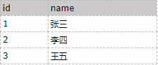
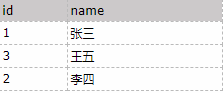
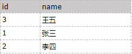

存在表A

 

按名字倒序排

SELECT  *  FROM  A  ORDER  BY  name  DESC

结果如下：

 

若需要按照王五、张三、李四的顺序排序，使用自定义排序:FIELD()

SELECT  *  FROM A  ORDER  BY  FIELD(name,  '王五',   '张三',   '李四')   ASC

 

MySQL中的field()函数，可以用来对SQL中查询结果集进行指定顺序排序

ORDER  BY  FIELD(field，str1，str2，str3，str4……)  DESC

field为排序字段

str1，str2，str3，str4…… 为指定的字段名字

 

 若除自定义排序还有其它字段排序直接加在后面即可

ORDER  BY  FIELD(field，str1，str2，str3，str4……)  DESC， [排序字段]   [排序方式]